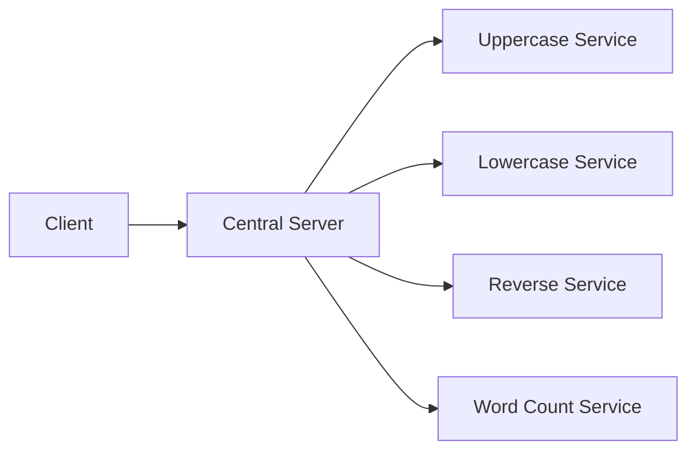

<<<<<<< HEAD
# Distributed-Systems---IITGN
Assignments done during the Distributed Systems and Cloud Computing Course at IITGN
=======
# Distributed Text Processing Service

A containerized microservices application for distributed text processing operations.

## Features

1.  **Uppercase**: Converts text to UPPERCASE.
2.  **Lowercase**: Converts text to lowercase.
3.  **Reverse**: Reverses the input string.
4.  **Word Count**: Counts the number of words in the text.

## Architecture

The system uses a hub-and-spoke model where a Central Server routes requests to specialized worker microservices.



## Prerequisites

-   Docker and Docker Compose
-   Python 3.10+ (for local client or verification script)

## Getting Started

### 1. Build and Start Services

```bash
docker-compose up -d --build
```

### 2. Verify Installation

You can run the automated verification script to ensure all services are communicating correctly:

```bash
python3 tests/verify_services.py
```

### 3. Run the Interactive Client

```bash
docker-compose run client
```

## Service Details

| Service | Port | Operation ID | Description |
| :--- | :--- | :--- | :--- |
| Central Server | 8080 | N/A | Entry point & Router |
| Uppercase | 5001 | 1 | UPPERCASE conversion |
| Lowercase | 5002 | 2 | lowercase conversion |
| Reverse | 5003 | 3 | Text reversal |
| Word Count | 5004 | 4 | Count words |

## Development

To stop all services:

```bash
docker-compose down
```
>>>>>>> b1269ce (Initial commit: Distributed Text Processing Service)
